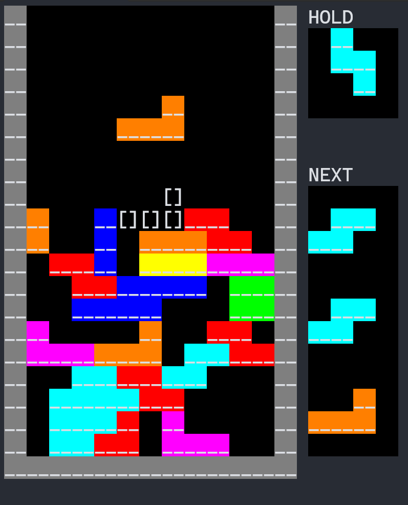
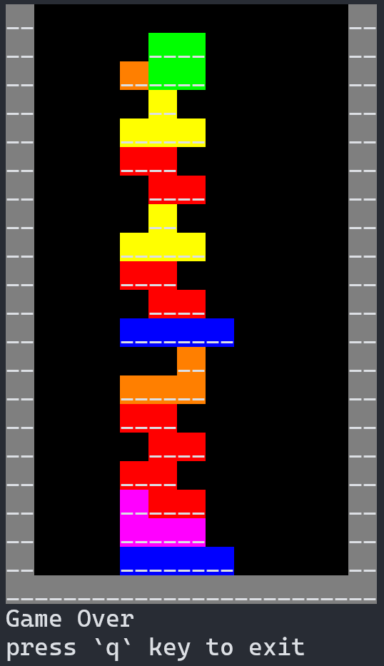

tetris (for Windows)
====================
This game allows you to display the block placement location, hold the block, and a list of upcoming blocks.  
It is a simple yet fun implementation of Tetris using golang and the Windows API.

Demo :D
----

GameOver :(
--------

